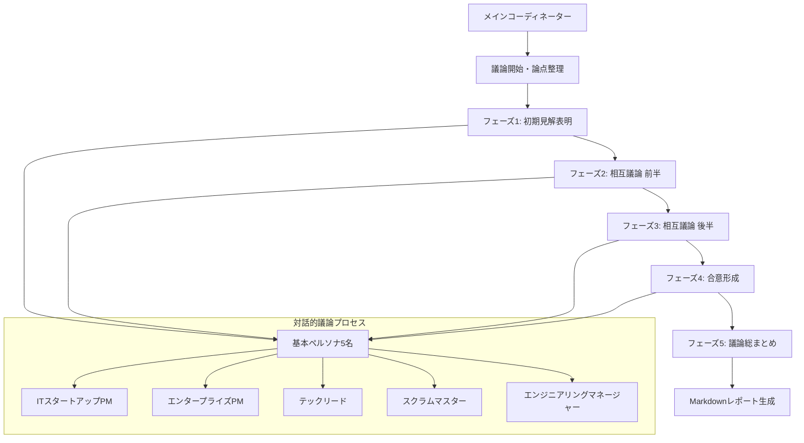
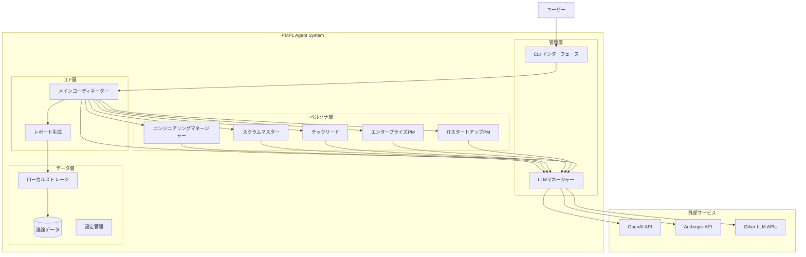

# PMPL エージェントシステム 技術仕様書

## 1. システムアーキテクチャ

### 1.1 全体アーキテクチャ

#### 1.1.1 議論フローダイアグラム



#### 1.1.2 システム構成図



### 1.2 エージェント階層構造

#### 1.2.1 Strands Agents実装構造

```python
# 基本構造（疑似コード）
class PMPLAgentSystem:
    def __init__(self):
        self.coordinator = MainCoordinator()
        self.sufficiency_judge = SufficiencyJudge()
        self.persona_agents = PersonaAgentFactory()
        self.analyzer = IssueAnalyzer()
        self.solver = SolutionGenerator()
        self.llm_manager = LLMManager()
    
    async def run_discussion(self, topic: str) -> DiscussionReport:
        # 議論実行メインフロー
        pass
```

## 2. 詳細設計

### 2.1 エージェント設計

#### 2.1.1 メインコーディネーターエージェント

```python
from strands import Agent, tool
from typing import List, Dict, Any

COORDINATOR_SYSTEM_PROMPT = """
あなたは複数のペルソナエージェントによる議論をファシリテートするメインコーディネーターです。

責務:
1. 議論テーマの論点を整理し、焦点を明確化する
2. ペルソナ間の対話を促進し、建設的な議論を誘導する
3. 意見の相違点を明確化し、深掘りすべき論点を特定する
4. 最終的な合意形成と統合された見解の作成を支援する
5. 議論全体の総まとめとエグゼクティブサマリーの作成

議論フロー:
フェーズ1: 初期見解表明（各ペルソナの専門的視点から課題分析）
フェーズ2-3: 相互議論（焦点論点に基づく対話的議論）
フェーズ4: 合意形成（統合的な見解と実行可能な解決策の提示）
フェーズ5: 総まとめ（PMPLが活用できる形での統合レポート作成）

人材マネジメントとプロセス改善の実践的解決策を目指してください。
"""

class MainCoordinator:
    def __init__(self, llm_manager: LLMManager):
        self.llm = llm_manager.get_llm("coordinator")
        self.persona_factory = PersonaAgentFactory()
    
    async def start_discussion(self, session: DiscussionSession, llm_manager: LLMManager) -> DiscussionRound:
        """対話的議論を開始"""
        basic_personas = self.persona_factory.get_basic_personas()
        discussion_round = session.add_round(basic_personas)
        
        await self._conduct_interactive_discussion(
            discussion_round, session.topic, session.organization_context, llm_manager
        )
        
        return discussion_round
    
    async def _conduct_interactive_discussion(self, discussion_round, topic, context, llm_manager):
        """5フェーズの対話的議論を実施"""
        # フェーズ1: 論点整理と初期見解
        await self._set_discussion_agenda(topic, context)
        await self._initial_statements_round(discussion_round, topic, context, llm_manager)
        
        # フェーズ2-3: 相互議論ラウンド
        for round_num in range(2, 4):
            await self._interactive_discussion_round(discussion_round, topic, context, llm_manager, round_num)
        
        # フェーズ4: 合意形成
        await self._consensus_building_round(discussion_round, topic, context, llm_manager)
        
        # フェーズ5: 議論総まとめ
        await self._generate_discussion_summary(discussion_round, topic, context)
```

#### 2.1.2 レポート生成システム

レポート生成は以下の構造で実装されています：

1. **エグゼクティブサマリー**: コーディネーターによる議論総まとめを最上位に配置
2. **参加者情報**: ペルソナプロファイルの表形式表示
3. **議論概要**: 統計情報とメトリクス
4. **フェーズ別議論詳細**: 5フェーズの詳細な議論ログ
5. **コーディネーター進行ガイダンス**: 各フェーズでの進行説明

レポートは `reports/` ディレクトリに出力され、Markdown形式で構造化されます。

```python
def _generate_simple_report(self, session: DiscussionSession) -> str:
    """レポート生成の主要機能"""
    # 1. コーディネーター総まとめを取得
    coordinator_summary = self._extract_coordinator_summary(session)
    
    # 2. エグゼクティブサマリーとして配置
    if coordinator_summary:
        report_lines.extend([
            "## 🎯 エグゼクティブサマリー",
            "*メインコーディネーターによる議論総まとめ*",
            coordinator_summary
        ])
    
    # 3. 参加者情報、議論詳細、フェーズ別分析を追加
    # ...
```

### 2.2 ペルソナエージェント設計

#### 2.2.1 基本ペルソナ仕様

```python
class PersonaAgent:
    def __init__(self, persona_config: PersonaConfig, llm_manager: LLMManager):
        self.config = persona_config
        self.agent = Agent(
            system_prompt=persona_config.system_prompt,
            tools=persona_config.tools,
            llm=llm_manager.get_llm(persona_config.llm_config)
        )
    
    async def discuss(self, topic: str, context: str) -> DiscussionOutput:
        """議論への参加と見解の提示"""
        pass

@dataclass
class PersonaConfig:
    name: str
    role: str
    experience_years: int
    organization_type: str
    expertise_areas: List[str]
    system_prompt: str
    tools: List[callable]
    llm_config: str
```

#### 2.2.2 具体的ペルソナ定義

```python
# ITスタートアップPMペルソナ
STARTUP_PM_PROMPT = """
あなたは3-5年の経験を持つITスタートアップのプロダクトマネージャーです。

**背景**:
- 20-30人規模の急成長スタートアップで勤務
- 限られたリソースで最大の成果を求められる環境
- スピード重視、完璧性よりも素早い意思決定を重視
- 技術者出身でエンジニアとの協業に長けている

**専門領域**:
- リソース制約下での優先順位付け
- 高速プロトタイピングと仮説検証
- 小規模チームでの効率的な開発プロセス
- 技術的負債とのバランス

**課題に対する視点**:
- 「まずはやってみる」アプローチ
- ROI（投資対効果）を常に意識
- チーム全員の当事者意識を重視
- プロセスよりも成果を重視

人材マネジメントとプロセス改善について、スタートアップ特有の制約と課題の観点から具体的な見解を述べてください。
"""

# エンタープライズPMペルソナ  
ENTERPRISE_PM_PROMPT = """
あなたは8-12年の経験を持つ大企業のプロダクトマネージャーです。

**背景**:
- 500人以上の大規模IT企業で勤務
- 複数部門との調整と承認プロセスが必要な環境
- 品質・セキュリティ・コンプライアンスを重視
- 長期的な戦略と持続可能性を重視

**専門領域**:
- 標準化されたプロセスの構築と運用
- リスク管理と品質保証
- ステークホルダー管理
- ドキュメント化と知識共有

**課題に対する視点**:
- プロセスの標準化と再現性
- リスクアセスメントと事前対策
- 長期的な組織能力向上
- 教育・研修体系の整備

10-50人規模組織が直面する「企業化」過程での課題について、エンタープライズの知見を活かした見解を述べてください。
"""
```

### 2.3 LLM管理システム

#### 2.3.1 LLMマネージャー設計

```python
from abc import ABC, abstractmethod
from enum import Enum
from dataclasses import dataclass
from typing import Optional, Dict, Any

class LLMProvider(Enum):
    OPENAI = "openai"
    ANTHROPIC = "anthropic"
    
class LLMModel(Enum):
    # OpenAI
    GPT_4O = "gpt-4o"
    GPT_4O_MINI = "gpt-4o-mini"
    GPT_35_TURBO = "gpt-3.5-turbo"
    
    # Anthropic
    CLAUDE_SONNET = "claude-3-sonnet-20240229"
    CLAUDE_HAIKU = "claude-3-haiku-20240307"

@dataclass
class LLMConfig:
    provider: LLMProvider
    model: LLMModel
    temperature: float = 0.7
    max_tokens: Optional[int] = None
    timeout: int = 30
    retry_count: int = 3

class LLMManager:
    def __init__(self, default_config: LLMConfig):
        self.default_config = default_config
        self.agent_configs: Dict[str, LLMConfig] = {}
        self.providers: Dict[LLMProvider, LLMProviderInterface] = {}
        
        # プロバイダーの初期化
        self._init_providers()
    
    def _init_providers(self):
        """LLMプロバイダーの初期化"""
        self.providers[LLMProvider.OPENAI] = OpenAIProvider()
        self.providers[LLMProvider.ANTHROPIC] = AnthropicProvider()
    
    def set_agent_config(self, agent_name: str, config: LLMConfig):
        """エージェント別LLM設定"""
        self.agent_configs[agent_name] = config
    
    def get_llm(self, agent_name: str) -> LLMInterface:
        """エージェント用LLMインスタンス取得"""
        config = self.agent_configs.get(agent_name, self.default_config)
        provider = self.providers[config.provider]
        return provider.create_llm(config)

class LLMProviderInterface(ABC):
    @abstractmethod
    def create_llm(self, config: LLMConfig) -> LLMInterface:
        pass

class OpenAIProvider(LLMProviderInterface):
    def create_llm(self, config: LLMConfig) -> LLMInterface:
        # OpenAI LLMインスタンス作成
        pass

class AnthropicProvider(LLMProviderInterface):  
    def create_llm(self, config: LLMConfig) -> LLMInterface:
        # Anthropic LLMインスタンス作成
        pass
```

### 2.4 データ設計

#### 2.4.1 議論データ構造

```python
from datetime import datetime
from typing import List, Optional, Dict, Any
from pydantic import BaseModel, Field
from enum import Enum

class DiscussionStatus(Enum):
    INITIALIZED = "initialized"
    ROUND1_IN_PROGRESS = "round1_in_progress"
    JUDGING = "judging"
    ROUND2_IN_PROGRESS = "round2_in_progress"
    ANALYZING = "analyzing"
    COMPLETED = "completed"
    FAILED = "failed"

class IssueCategory(Enum):
    TALENT_MANAGEMENT = "talent_management"
    PROCESS_IMPROVEMENT = "process_improvement"
    ORGANIZATIONAL_SCALING = "organizational_scaling"

class IssuePriority(Enum):
    HIGH = "high"
    MEDIUM = "medium"
    LOW = "low"

class PersonaStatement(BaseModel):
    persona_name: str
    persona_role: str
    statement: str
    identified_issues: List[str]
    proposed_solutions: List[str]
    timestamp: datetime
    llm_model: str

class DiscussionRound(BaseModel):
    round_id: int
    participants: List[str]
    statements: List[PersonaStatement]
    identified_issues: List[str]
    started_at: datetime
    completed_at: Optional[datetime] = None

class SufficiencyJudgment(BaseModel):
    overall_score: float = Field(ge=0, le=100)
    coverage_analysis: Dict[str, float]  # カテゴリ別カバレッジスコア
    missing_areas: List[str]
    recommended_personas: List[str]
    reasoning: str
    needs_additional_round: bool

class IdentifiedIssue(BaseModel):
    id: str
    title: str
    description: str
    category: IssueCategory
    priority: IssuePriority
    root_causes: List[str]
    affected_areas: List[str]
    mentioned_by: List[str]  # 言及したペルソナ

class ProposedSolution(BaseModel):
    id: str
    issue_id: str
    title: str
    description: str
    implementation_steps: List[str]
    required_resources: List[str]
    timeline: str
    risks: List[str]
    expected_outcomes: List[str]

class DiscussionSession(BaseModel):
    session_id: str
    topic: str
    organization_context: Dict[str, Any]
    status: DiscussionStatus
    rounds: List[DiscussionRound]
    sufficiency_judgments: List[SufficiencyJudgment]
    final_issues: List[IdentifiedIssue]
    final_solutions: List[ProposedSolution]
    created_at: datetime
    updated_at: datetime
    completed_at: Optional[datetime] = None
    
    class Config:
        json_encoders = {
            datetime: lambda v: v.isoformat()
        }
```

### 2.5 レポート生成システム

#### 2.5.1 Markdownレポート生成器

```python
from jinja2 import Template
from typing import Dict, Any

class ReportGenerator:
    def __init__(self):
        self.template = self._load_template()
    
    def generate_report(self, session: DiscussionSession) -> str:
        """議論セッションからMarkdownレポートを生成"""
        context = self._prepare_context(session)
        return self.template.render(**context)
    
    def _load_template(self) -> Template:
        template_str = """
# PMPL課題分析レポート

**生成日時**: {{ generated_at }}  
**セッションID**: {{ session_id }}  
**議論テーマ**: {{ topic }}

## エグゼクティブサマリー

### 議論参加者

**ラウンド{{ round.round_id }}**:

- {{ participant }}



### 主要課題 ({{ issues|length }}項目)

{{ loop.index }}. **{{ issue.title }}** ({{ issue.priority.value|upper }})
   - {{ issue.description }}


## 課題詳細分析

### 人材マネジメント課題

#### {{ issue.title }} 
**優先度**: {{ issue.priority.value|upper }}

**課題詳細**:
{{ issue.description }}

**根本原因**:

- {{ cause }}


**影響範囲**:

- {{ area }}


**言及者**: {{ issue.mentioned_by|join(', ') }}

---


### プロセス改善課題

#### {{ issue.title }}
**優先度**: {{ issue.priority.value|upper }}

**課題詳細**:
{{ issue.description }}

**根本原因**:

- {{ cause }}


**影響範囲**:

- {{ area }}


**言及者**: {{ issue.mentioned_by|join(', ') }}

---


## 解決策提案


### {{ solution.title }}
**対象課題**: {{ solution.issue_id }}

**概要**:
{{ solution.description }}

**実装ステップ**:

{{ loop.index }}. {{ step }}


**必要リソース**:

- {{ resource }}


**実装期間**: {{ solution.timeline }}

**リスク**:

- {{ risk }}


**期待効果**:

- {{ outcome }}


---


## 実装ロードマップ

### 短期施策（1-3ヶ月）

- **{{ solution.title }}**: {{ solution.timeline }}


### 中期施策（3-12ヶ月）

- **{{ solution.title }}**: {{ solution.timeline }}


### 長期施策（1年以上）

- **{{ solution.title }}**: {{ solution.timeline }}


## 議論ログサマリー


### ラウンド{{ round.round_id }} ({{ round.started_at.strftime('%Y-%m-%d %H:%M') }})


#### {{ statement.persona_name }}の見解
{{ statement.statement }}

**特定した課題**:

- {{ issue }}




## 十分性評価


**評価ラウンド{{ loop.index }}**:
- **総合スコア**: {{ judgment.overall_score }}/100
- **追加議論要否**: {{ "必要" if judgment.needs_additional_round else "不要" }}

**領域別カバレッジ**:

- {{ area }}: {{ score }}/100


**評価理由**:
{{ judgment.reasoning }}

"""
        return Template(template_str)
```

## 3. API設計

### 3.1 エンドポイント仕様

```python
from fastapi import FastAPI, HTTPException
from pydantic import BaseModel
from typing import Optional

app = FastAPI(title="PMPL Agent System API")

class DiscussionRequest(BaseModel):
    topic: str
    organization_context: Optional[Dict[str, Any]] = None
    llm_config: Optional[Dict[str, Any]] = None

class DiscussionResponse(BaseModel):
    session_id: str
    status: str
    message: str

@app.post("/discussions", response_model=DiscussionResponse)
async def start_discussion(request: DiscussionRequest):
    """新しい議論セッションを開始"""
    pass

@app.get("/discussions/{session_id}")
async def get_discussion_status(session_id: str):
    """議論セッションの状態を取得"""
    pass

@app.get("/discussions/{session_id}/report")
async def get_discussion_report(session_id: str):
    """議論セッションのレポートを取得"""
    pass

@app.post("/discussions/{session_id}/configure-llm")
async def configure_llm(session_id: str, config: Dict[str, Any]):
    """セッション単位でLLM設定を変更"""
    pass
```

## 4. 設定管理

### 4.1 環境設定

```yaml
# config/default.yaml
system:
  default_llm:
    provider: "openai"
    model: "gpt-4o"
    temperature: 0.7
    max_tokens: 2000
    
agents:
  coordinator:
    llm:
      provider: "openai"
      model: "gpt-4o"
      temperature: 0.3
  
  judge:
    llm:
      provider: "openai"
      model: "gpt-4o"
      temperature: 0.1
      
  personas:
    startup_pm:
      llm:
        provider: "openai"
        model: "gpt-4o-mini"
        temperature: 0.8
    
discussion:
  max_rounds: 3
  sufficiency_threshold: 75.0
  timeout_minutes: 30

storage:
  type: "local"  # "local" or "database"
  path: "./data/discussions"
```

## 5. 実装優先順位

### Phase 1: 基本機能 (3週間)
1. LLMマネージャー実装
2. 基本ペルソナエージェント5体実装
3. シンプルな議論フロー実装
4. 基本的なレポート生成

### Phase 2: 高度な機能 (2週間)  
1. 課題十分性判定エージェント実装
2. 動的ペルソナ選定機能
3. 詳細なデータ構造実装

### Phase 3: 品質向上 (2週間)
1. エラーハンドリング強化
2. ログ・監視機能実装
3. テストカバレッジ向上
4. パフォーマンス最適化

### Phase 4: 運用準備 (1週間)
1. Docker化
2. CI/CD設定
3. ドキュメント整備
4. デモ・サンプル作成 